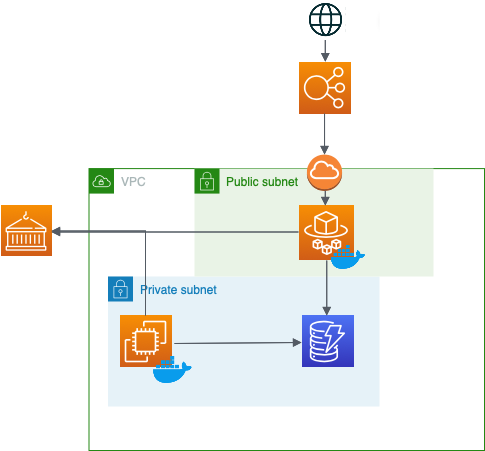
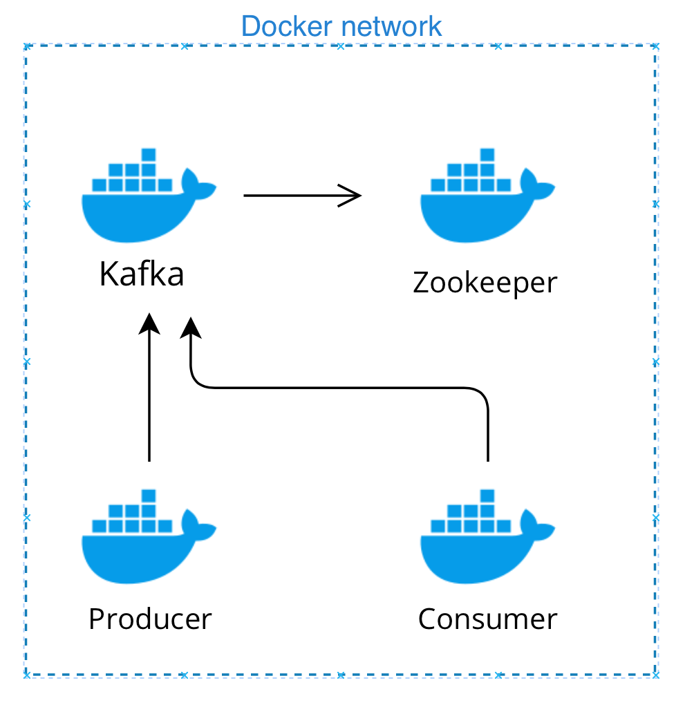

### Introduction 

With this project I am building a distributed system to display earthquakes in real time on a map, accessible via your browser. the front end service has an upstream loadbalancer to scale out if needed. Data is streamed from an [external service by the EMSC](https://www.seismicportal.eu/realtime.html) using springboot Kafka in a docker-compose setup. The whole Aws infrastructure is created and configured using Terraform. 

### Process walk through 

### Architecture

__Kafka__ 

To display earthquakes in real time I need to extract them in real time from their source. This is where Kafka comes into play in this project. The producer extracts the new earthquakes using a websocket, creates a JSONObject and serealizes them using a custom serealizer. Once they are pushed to the kafka topic the consumer pulls them and deserealizes them again using a custom deserealizer, which turns them back into a JSONObject. 

Apache Kafka is a distributed streaming platform which makes it easy to integrate various producers and consumers with each others. In theory kafka offers extremly high througput and easy scalability with relativly low latency. To run Kafka you need Zookeeper, which keeps track of of status of the Kafka cluster nodes as well as Kafka topics, partitions etc.

*Kafka Docker setup:*

The streaming microservice sits on an EC2 machine and is defined using docker compose. 
The custom producer and consumer containers will be uploaded to AWS ECR and later pulled from there. 
