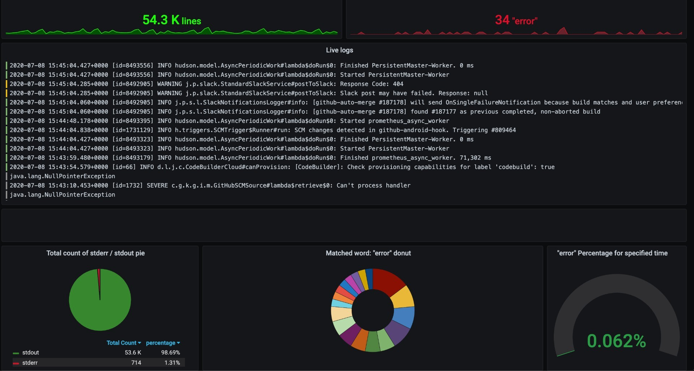

### Introduction 

With this project I am building a distributed system to display earthquakes in real time on a map, accessible via your browser. the front end service has an upstream loadbalancer to scale out if needed. Data is streamed from an [external service by the EMSC](https://www.seismicportal.eu/realtime.html) using springboot Kafka in a docker-compose setup. The whole Aws infrastructure is created and configured using Terraform. 

### Process walk through 

### Architecture

__Kafka__ 

To display earthquakes in real time I need to extract them in real time from their source. This is where Kafka comes into play in this project. The producer extracts the new earthquakes using a websocket, creates a JSONObject and serealizes them using a custom serealizer. Once they are pushed to the kafka topic the consumer pulls them and deserealizes them again using a custom deserealizer, which turns them back into a JSONObject. 

Apache Kafka is a distributed streaming platform which makes it easy to integrate various producers and consumers with each others. In theory kafka offers extremly high througput and easy scalability with relativly low latency. To run Kafka you need Zookeeper, which keeps track of of status of the Kafka cluster nodes as well as Kafka topics, partitions etc.

*Kafka Docker setup:*

The streaming application sits on an EC2 machine and is defined using docker compose. 
The custom producer and consumer containers will be uploaded to AWS ECR and later pulled from there. 

__Consumer & Producer__

Both Consumer and Producer are implemented in Java with SpringBoot. 
The Producer has an open websocket, that listens for new events (an event is an earthquake that has occured). The event is turned into a custom JSONObject with the relevant keys for the scope of this application. The Json is then serealized using a custom serealizer to send it to Kafka. In the scope of Kafka serealization refers turning an object into a stream of bytes that can be transmitted into the queue. 

The Consumer reads the events that have arrived and deserealizes it into a JSONObject. In the next step it is written to DynamoDB, a NoSql Key-Value store on AWS, using the AWS SDK. For security reasons I have opted against using credentials, but instead assuming the role of the underlying EC2 instance, which has just the required least priviledges. 

__Logging__ 

Application logging is done with Loki and Grafana in docker containers to extract and visualize logs. I have used the docker Loki plugin, which extracts the logs from all containers and the Loki instance ships them to Grafana. 
Grafana allows one to query the logs and visualize them. You can access Grafana from your machine using the EC2 instances IP adress and the port 3000. I have set the log level of Loki to info, which means it extracts all logs. You can adjust that in the  loki-config.yaml file. 

Here is example Grafana dashbaord:

__Database__

As a database I have used DynamoDB. DynamoDB is a key-value store on AWS that uses 3 storage nodes across which data is partitioned according to the hash value of a private key. DynamoDB moreover has the option of global tables, where a table is replicated across multiple regions. If the frontend service gets accessed from all over the world, global tables can reduce latency by a lot. Moreover global tables make writing to replicated tables and keeping consistency across regions very simple, by handling all of that within AWS. 

__Frontend service__

__Load balancer__

