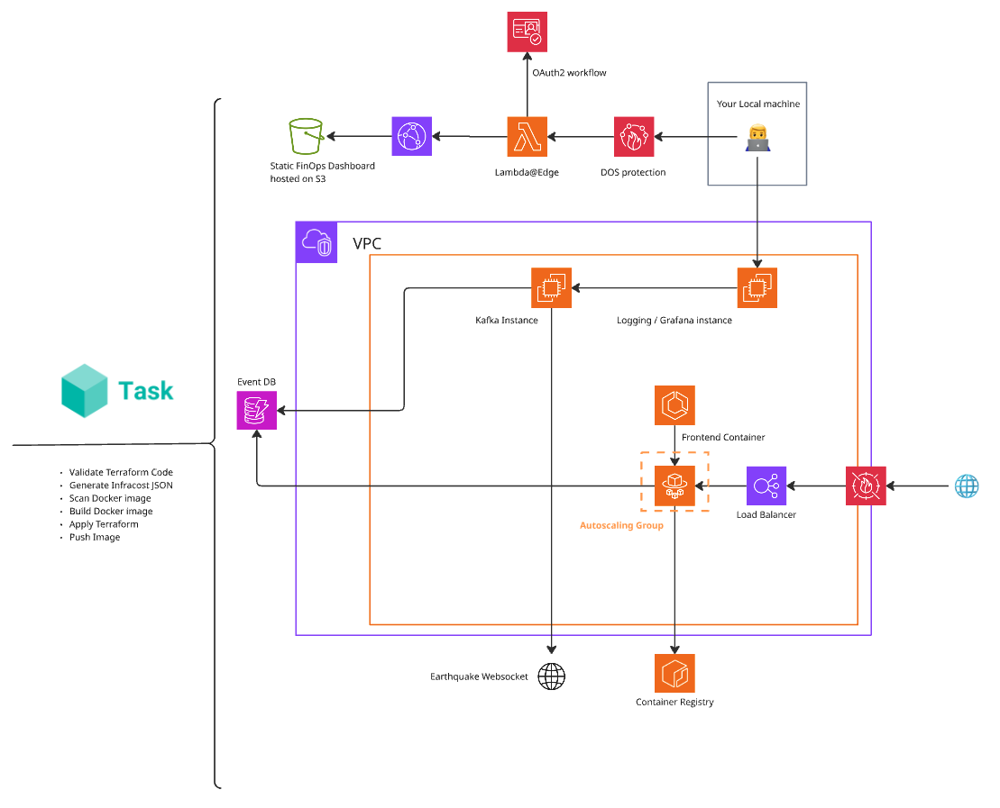
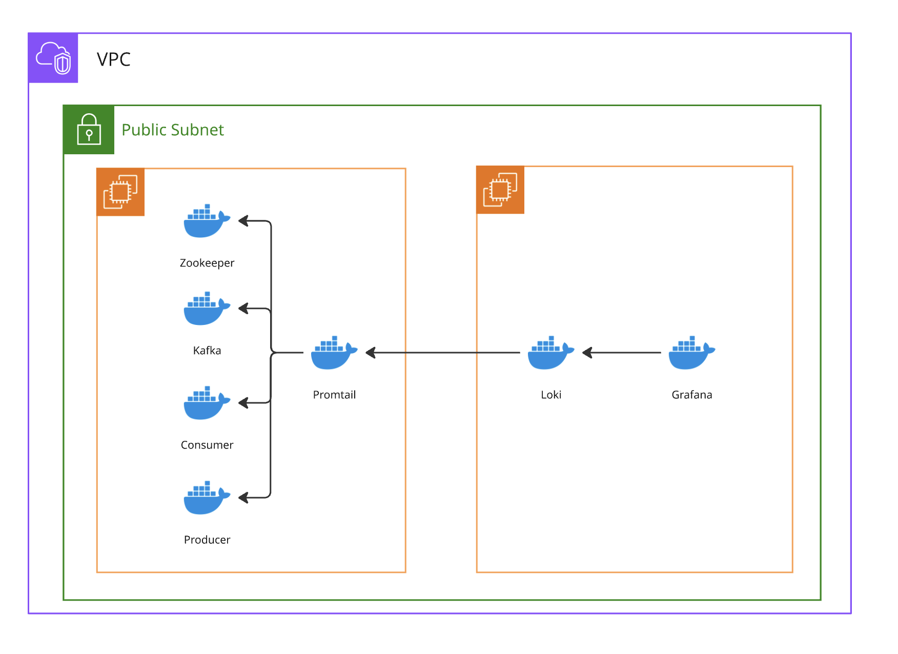
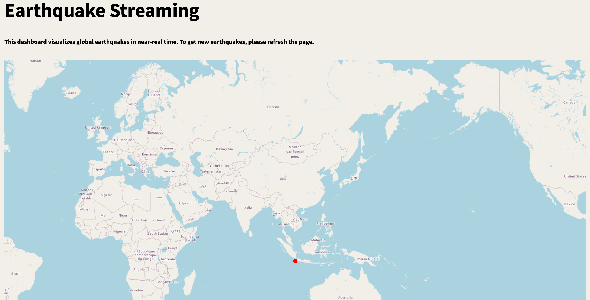

### Introduction 

With this project I am building a distributed system to display earthquakes in real time on a map, accessible via your browser. The front end service has an upstream loadbalancer to scale out if needed. Data is streamed from an [external service by the EMSC](https://www.seismicportal.eu/realtime.html) using Springboot Kafka in a Docker Compose setup. The whole AWS infrastructure is created and configured using Terraform. All configurations and relevant role priviledges will be preconfigured, such that you can simply host the application with one command. In addition to that I have implemented logging of the backend using promtail, loki and grafana.  

All roles within this project are assumed by services, such that no credentials are used and I have followed the principle of least privileges. 

### Structure 

- [Process walk through](#process-walk-through) 
- [Architecture](#architecture)
- [How to run the project](#how-to-run-the-project)
- [Future outlook](#future-outlook)

### Process walk through 

Once a new event occurs, the Kafka producer will register it and send it to Kafka. The Consumer then reads it and inserts the event into DynamoDB. All logs produced during this process, are collected by promtail and forwarded to loki on another EC2 instance. They are visualized using a Grafana Dashboard to Monitor this part of the system. 

When a user makes a request to the frontend service, an ELB application load balancer routes it to one of the frontend service containers, which are in a private subnet. These containers are deployed via AWS Fargate, read the events from DynamoDB and display them on an interactive map. 

### Architecture


*Note: I have left nat- / internet gateways and route tables out of diagram, for simplification reasons*

__Kafka__ 

Apache Kafka is a distributed streaming platform which makes it easy to integrate various producers and consumers with each others. In theory kafka offers extremly high througput and easy scalability with relativly low latency.

The Kafka producer extracts the new earthquakes using a websocket, creates a JSONObject and serealizes them using a custom serealizer. Once they are pushed to the kafka topic the consumer pulls them and deserealizes them again using a custom deserealizer, which turns them back into a JSONObject. 

The streaming application sits on an EC2 t2-large machine and is defined using docker compose. All services within the Kafka cluster sit in Docker containers. 


__Consumer & Producer__

Both Consumer and Producer are implemented in Java with SpringBoot. 
The Producer has an open websocket, that listens for new events (an event is an earthquake that has occured). The event is turned into a custom JSONObject with the relevant keys for the scope of this application. The Json is then serealized using a custom serealizer to send it to Kafka. In the scope of Kafka, serealization refers turning an object into a stream of bytes that can be transmitted into the queue. 

The Consumer reads the events that have arrived and deserealizes it into a JSONObject. In the next step it is written to DynamoDB, a NoSql Key-Value store on AWS, using the AWS SDK. For security reasons I have opted against using credentials, but instead assuming the role of the underlying EC2 instance, which has just the required least priviledges, i.e is allowed to write to exactly this table. 

*This is a detailed visual representation of the Kafka and logging setup:*


__Logging__ 

I chose to seperate the streaming backend and logging microservice on different Ec2-Instances. Since I am using the private IP-adress to send logs and both instances are within the same availability zone, __data transfer is free__. 
Application logging is done with Promtail, Loki and Grafana in Docker containers to extract and visualize logs.
On the Kafka Ec2-Instance promtail collects the logs from all containers and ships them to loki on another Ec2-Instance (using it's private IP, since both are within the same subnet). On the other instance Grafana can be used to visualize the logs within Loki.

You can access Grafana from your machine using the logging-EC2 instances IP adress and the port 3000. All connections have already been preconfigured. 

Here is example Grafana dashboard where I have filtered the logs of the producer container for uuid, meaning any new record that has been sent to Kafka is displayed:


__Database and regional replication__

As a database I have used DynamoDB. DynamoDB is a key-value store on AWS that uses 3 storage nodes across which data is partitioned according to the hash value of a private key. Moreover the WAL is backuped on S3. By handling all of that internaly I can focus on other parts of the app. Moreover DynamoDB  has the option of global tables, where a table is replicated across multiple regions. If the frontend service gets accessed from all over the world, global tables can reduce latency by a lot. In addition to that global tables make writing to replicated tables and keeping consistency across regions very simple, by handling all of that within AWS.
You can set the regions in which the table should be replicated within the [var.tf](./terraform/var.tf) file under global_table_replication_region. Terraform will automatically create the table within your region and the chosen replication region.

__Frontend service__

The Frontend is a containerized streamlit app. Once you run a terraform apply command, the image is automatically built and uploaded to AWS Ecr. A Fargate task pulls the image from there. The frontend can get the eartquake data from DynamoDb using the assumed role by Fargate. 

*This is how the Dashboard currently looks like:*


__Load balancing & scaling__

I was thinking of using AWS AppRunner for running the frontend in a simple way. However when comparing cost, it became clear that in a production environment where the frontend scales to multiple containers, the implementation with an Elb LoadBalancer and fargate will become way cheaper. The application load balancer redirects all HTTP traffic to port 8501 of the frontend container. It has a rule, that if 90% of the ram of a frontend container is used, it will scale out another one. Since this project is not intended for production usage, the maximum amount of running containers is 2. Currently all created containers will be within one AZ. However there is the possibility fo further advance this project and scale out in different regions depending on traffic. The DynamoDb table will already be replicated across a region, you can choose.


### How to run the project

Since I have already preconfigured everything, you only need a few things and undergo little effort to create the project. 
__Note:__ This project will lead to costs on AWS, I am by no means repsonsible for any charges on your account. 

You need to have Terraform installed, and authenticated with AWS as wel as beeing able to execute shell scripts. Last, the ability to build docker containers is a requirement too. 

Once that has been made sure, you have to replace some variables in [var.tf](/terraform/var.tf). They are:

- aws_region: The region in which you want your services to sit
- global_table_replication_region: The region in which the global table should be replicated 
- my_ip: Your host machines IP address 
- account_id: Your AWS account id 

Afterfards you need to start the docker daemon, navigate into the terraform folder and run:
```bash
terraform init 
```

```bash
terraform apply 
```

The whole project including configurations will now be created for you. Terraform does not only create AWS ressources for you, but will also request the docker daemon to build the frontend image and push it to Ecr. In addition to that I have created two scripts to [initiate services on the logging server](terraform/initiate_logging.sh) and to [initiate services on the Kafka server](terraform/initiate.sh), which will install all required dependencies on them and start the required containers with their respective dependencies.

### Future outlook 

These are some topics, which could be added next:

- TLS encryption of traffic 
- Firewall
- Replicating the frontend service across regions 
- Kubernetes deployment 